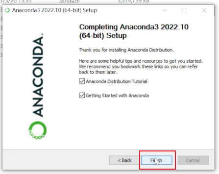

# **Yolov5 环境配置**

## **目录**

1. 安装 anaconda3
2. 配置虚拟环境
3. 安装软件包

## **安装 anaconda3**

访问 anaconda3 的官网下载安装包

<https://www.anaconda.com>

打开下载的安装包安装 anaconda3,不需要太操心,也没有什么注意的地方,直接**下一步**就好.看到以下页面就代表安装完成.

## **配置虚拟环境**

接下来新建一个虚拟环境,防止我们误操作污染主环境.

在弹出的命令窗口中输入这些命令新建一个虚拟环境.

        conda create -n yolov5 python=3.8
        # 新建一个名为yolov5的虚拟环境
        # 指定python的版本为3.8
        # 在弹出的提示中输入y

        conda activate yolov5
        # 切换到yolov5这个虚拟环境

## **安装软件包**

切换到yolov5的文件夹里面,有一个"requirements.txt",这里面已经写了要安装什么,在虚拟环境中直接运行下面这一串指令就可以安装.

        pip install -r requirements.txt

环境配置的文档就到这里
        