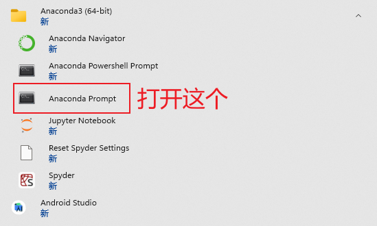
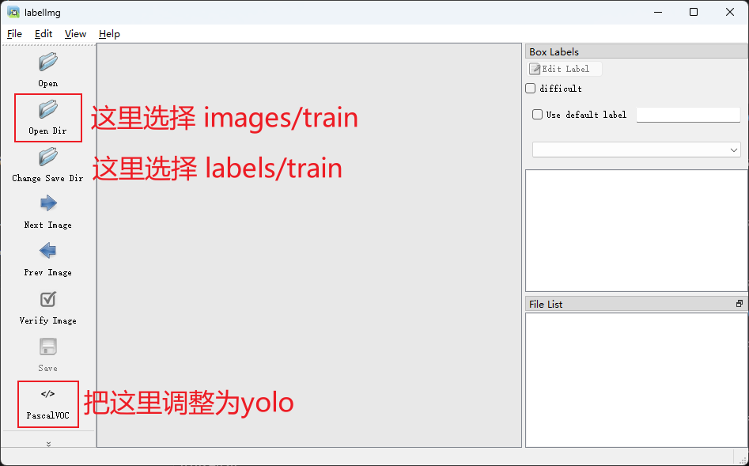

# **Yolov5 标注数据**

## **目录**

1. 新建一个py3.9的环境
2. 下载 labelImg
3. 标注数据文件结构
4. 标注

## **新建一个py3.9的环境**

打开AnacondaPrompt

        conda create -n labelImg python=3.9
        # 新建环境

        conda activate labelImg
        # 切换环境

## **下载 labelImg**

通过pip安装labelImg

        pip install labelImg

## **标注数据文件结构**

**这一步很重要,直接关系到训练,请认真浏览！！**一个数据集的文件结构应该是这样：

        Yolo_train # 数据集的名字可以自己取，不要中文
        | - images
        |   | - train
        |   |   | - 1.jpg # 这个文件夹下放图片
        |   |   | - ...
        |   | - val
        |   |   | - 1.jpg # 这个文件夹也需要放图片，但不需要train文件夹那么多
        |   |   | - ...
        | - labels
        |   | - train
        |   |   | - 1.txt # 放images/train下对应的图片的标注文件
        |   |   | - ...
        |   | - val
        |   |   | - 1.txt # images/val下对应的图片的标注文件
        |   |   | - ...

文件结构应该严格*按照*上面的取，不能**错**！

## **标注**

在命令框中输入labelImg打开labelImg

        labelImg

然后就可以开始标注数据了
